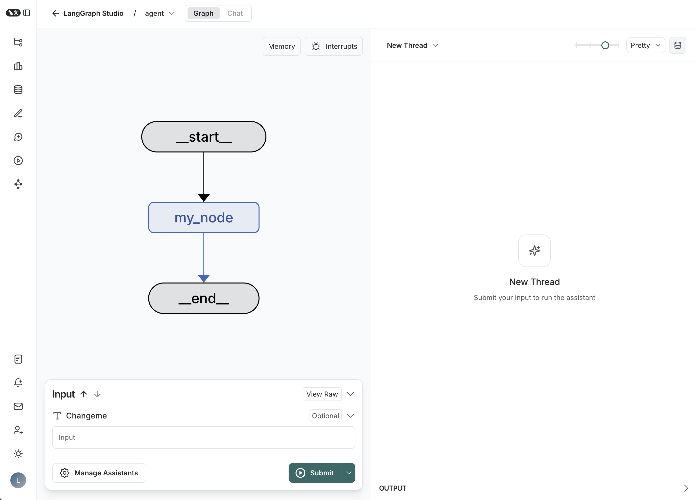

# Semantic Research Chat

A web-based semantic information retrieval assistant that generates rationalized, referenced research reports from user questions. Powered by LangGraph, LangChain, Anthropic Claude, and Tavily search.



## Features

- **Semantic Question Understanding:** Breaks down complex questions into actionable subtasks.
- **Automated Web Search:** Uses Tavily to find relevant, up-to-date information.
- **LLM Synthesis:** Uses Anthropic Claude to generate mini-reports and a comprehensive final report.
- **References:** All claims are supported by clickable, numbered references.
- **Chat UI:** Simple, modern web interface for interactive research.

## Quickstart

### 1. Clone the repository

```bash
git clone https://github.com/your-username/semantic-research-chat.git
cd semantic-research-chat
```

### 2. Install dependencies

```bash
pip install -r requirements.txt
# or, if using pyproject.toml:
pip install "fastapi[all]" uvicorn langgraph python-dotenv langchain-anthropic langchain-community tavily-python
```

### 3. Set up API keys

Create a `.env` file in the project root:

```
ANTHROPIC_API_KEY=your_anthropic_api_key
TAVILY_API_KEY=your_tavily_api_key
```

### 4. Run the app

```bash
uvicorn main:app --reload
```

Visit [http://localhost:8000](http://localhost:8000) in your browser.

## Project Structure

```
.
├── main.py
├── src/
│   └── agent/
│       └── graph.py
├── templates/
│   └── chat.html
├── static/
├── .env
├── README.md
└── ...
```

## How it Works

1. **User asks a question** in the chat UI.
2. **Pipeline**:
    - The question is broken into subtasks (planning agent).
    - Each subtask is turned into search queries (query generation agent).
    - Tavily retrieves relevant documents for each query (retriever agent).
    - Mini-reports are generated for each subtask (mini-report agent).
    - A final report is synthesized, with in-text citations and a reference list (final report agent).
3. **References** are shown as clickable links in a dropdown.

## Customization

- You can swap out the LLM, retriever, or UI with minimal changes.
- Prompts are defined in `src/agent/graph.py` and can be tuned for your use case.

## License

MIT
